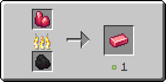

# Рудный драгонит

Предмет, выпадающий в результате добывания [драгонитовой руды](../../rudy/dragonitovaya-ruda.md).

<figure><figcaption></figcaption></figure>

## Получение

#### _Добывание_

Одна единица рудного драгонита выпадает в результате добывания [драгонитовой руды](../../rudy/dragonitovaya-ruda.md).


Инструменты с зачарованием _**Удача**_\*\* \*\* не будут работать на [драгонитовой руде](../../rudy/dragonitovaya-ruda.md)



Инструменты с зачарованием _**Шёлковое касание**_ будут добывать [драгонитовую руду](../../rudy/dragonitovaya-ruda.md), вместо рудного драгонита


#### _Крафт_

<figure><figcaption></figcaption></figure>

## Использование

Рудный драгонит можно переплавить в [драгонитовый слиток](dragonitovyi-slitok.md).

#### _Как ингредиент для крафта_

<figure><figcaption></figcaption></figure>

#### _Плавка_

<figure><figcaption></figcaption></figure>
