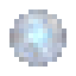

# Камень луны

<figure><figcaption></figcaption></figure>

## Получение

#### _Крафт_

| ㅤ                                                     |  Камень луны                             |
| ----------------------------------------------------- | ---------------------------------------- |
| 
<a href="catalyst.md">Квазар</a> + Обсидиан
 |  |

## Использование

#### _Как ингредиент при крафте_

#### [Драгоценный камень ночи](perk_gem_night.md)

| ㅤ                                                                                                                       |  Драгоценный камень ночи                        |
| ----------------------------------------------------------------------------------------------------------------------- | ----------------------------------------------- |
| 
Осколок аметиста + <a href="moonstone.md">Камень луны</a> + <a href="fireite_ingot.md">Огненный слиток</a>
 |  |

