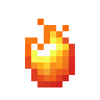

# Осколок нитроника

<figure><figcaption></figcaption></figure>

## Получение

#### _Крафт_

| ㅤ                                     | Осколок нитроника                               |
| ------------------------------------- | ----------------------------------------------- |
| [Смесь нитроника](nitronic\_blend.md) |  |

## Использование

#### _Как ингредиент при крафте_

#### [Грубый барион](baryon\_1.md)

| ㅤ                                                                                                               | Грубый барион                            |
| --------------------------------------------------------------------------------------------------------------- | ---------------------------------------- |
| 
<a href="empowered_coal.md">Заряженный уголь</a> + <a href="nitronic_nugget.md">Осколок нитроника</a>
 |  |

#### [Грубый мезон](meson\_1.md)

| ㅤ                                        | Грубый мезон                            |
| ---------------------------------------- | --------------------------------------- |
| [Осколок нитроника](nitronic\_nugget.md) |  |
