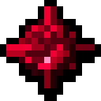

# Кусок Пардимала

<figure><figcaption></figcaption></figure>

## Получение

#### _Крафт_

| ㅤ                                                                                                            |  Кусок Пардимала                              |
| ------------------------------------------------------------------------------------------------------------ | --------------------------------------------- |
| 
<a href="cermile_lump.md">Кусок Цермила</a> + Алмаз + <a href="fury_fire.md">Яростный огонь</a>
 |  |

## Использование

#### _Как ингредиент при крафте_

#### [Кусок Квадротика](quadrotic_lump.md)

| ㅤ                                                                                                               |  Кусок Квадротика                              |
| --------------------------------------------------------------------------------------------------------------- | ---------------------------------------------- |
| 
<a href="pardimal_lump.md">Кусок Пардимала</a> + Алмаз + <a href="fury_fire.md">Яростный огонь</a>
 |  |

