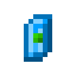

# Драгоценный камень неба

<figure><figcaption></figcaption></figure>

## Получение

#### _Крафт_

| ㅤ                                                                                    |  Драгоценный камень неба                      |
| ------------------------------------------------------------------------------------ | --------------------------------------------- |
| 
Пиротехническая звезда + <a href="catalyst.md">Квазар</a> + Слеза гаста
 |  |

## Использование

#### _Как ингредиент при крафте_

#### [Очищенный кристалл маны](refained_mana_crystal2.md)

| ㅤ                                                                                                                                                    |  Очищенный кристалл маны                                |
| ---------------------------------------------------------------------------------------------------------------------------------------------------- | ------------------------------------------------------- |
| 
<a href="perk_gem_sky.md">Драгоценный камень неба</a> + <a href="aquamarine.md">Аквамарин</a> + <a href="mana_pearl.md">Жемчуг маны</a>
 |  |

