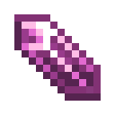

# Темный кристалл слизня

<figure><figcaption></figcaption></figure>

## Получение

#### _Крафт_

| ㅤ                                                                                                                         |  Темный кристалл слизня                             |
| ------------------------------------------------------------------------------------------------------------------------- | --------------------------------------------------- |
| 
Сгусток слизи + <a href="purple_blaze.md">Фиолетовое пламя</a> + <a href="dark_crystal.md">Кристалл тьмы</a>
 |  |

## Использование

#### _Как ингредиент при крафте_

#### [Сумеречная дуга](dusk_arc.md)

| ㅤ                                                                                                                                                               |  Сумеречная дуга                         |
| --------------------------------------------------------------------------------------------------------------------------------------------------------------- | ---------------------------------------- |
| 
<a href="dark_matter.md">Темная материя</a> + <a href="pink_slime_crystal.md">Темный кристалл слизня</a> + <a href="darkness.md">Эссенция тьмы</a>
 |  |

