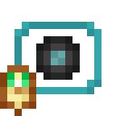

# Обработанный барион

<figure><figcaption></figcaption></figure>

## Получение

#### _Крафт_

| ㅤ                                                                               |  Обработанный барион                        |
| ------------------------------------------------------------------------------- | ------------------------------------------- |
| 
Огненный порошок + <a href="baryon_1.md">Грубый барион</a> + Сахар
 |  |

## Использование

#### _Как ингредиент при крафте_

#### [Блестящий барион](baryon_3.md)

| ㅤ                                                                                     |  Блестящий барион                           |
| ------------------------------------------------------------------------------------- | ------------------------------------------- |
| 
Огненный порошок + <a href="baryon_2.md">Обработанный барион</a> + Сахар
 |  |

