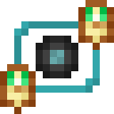

# Блестящий барион

<figure><figcaption></figcaption></figure>

## Получение

#### _Крафт_

| ㅤ                                                                                     |  Блестящий барион                           |
| ------------------------------------------------------------------------------------- | ------------------------------------------- |
| 
Огненный порошок + <a href="baryon_2.md">Обработанный барион</a> + Сахар
 |  |

## Использование

#### _Как ингредиент при крафте_

#### [Великолепный барион](baryon_4.md)

| ㅤ                                                                                  |  Великолепный барион                        |
| ---------------------------------------------------------------------------------- | ------------------------------------------- |
| 
Огненный порошок + <a href="baryon_3.md">Блестящий барион</a> + Сахар
 |  |

