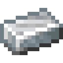

# Костный слиток

<figure><figcaption></figcaption></figure>

## Получение

#### _Крафт_
## Использование

#### _Как ингредиент при крафте_

#### [Костный прототип](bone_prototype.md)

| ㅤ                                                                                        |  Костный прототип                                 |
| ---------------------------------------------------------------------------------------- | ------------------------------------------------- |
| 
Огненный порошок + <a href="bone_basic.md">Костный слиток</a> + Комок глины
 |  |

