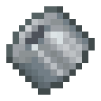

# Костный пробный продукт

<figure><figcaption></figcaption></figure>

## Получение

#### _Крафт_

| ㅤ                                                                                              |  Костный пробный продукт                                  |
| ---------------------------------------------------------------------------------------------- | --------------------------------------------------------- |
| 
Огненный порошок + <a href="bone_prototype.md">Костный прототип</a> + Комок глины
 |  |

## Использование

#### _Как ингредиент при крафте_

#### [Модифицированная кость](bone_modified.md)

| ㅤ                                                                                                            |  Модифицированная кость                          |
| ------------------------------------------------------------------------------------------------------------ | ------------------------------------------------ |
| 
Огненный порошок + <a href="bone_trial_production.md">Костный пробный продукт</a> + Комок глины
 |  |

