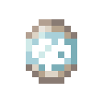

# Средняя клетка

<figure><figcaption></figcaption></figure>

## Получение

#### _Крафт_

| ㅤ                                                                                                 |  Средняя клетка                                |
| ------------------------------------------------------------------------------------------------- | ---------------------------------------------- |
| 
Огненный порошок + <a href="cage_small.md">Маленькая клетка</a> + Светокаменная пыль
 |  |

## Использование

#### _Как ингредиент при крафте_

#### [Большая клетка](cage_large.md)

| ㅤ                                                                                                |  Большая клетка                               |
| ------------------------------------------------------------------------------------------------ | --------------------------------------------- |
| 
Огненный порошок + <a href="cage_medium.md">Средняя клетка</a> + Светокаменная пыль
 |  |

