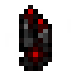

# Заряженный уголь

<figure><figcaption></figcaption></figure>

## Получение

#### _Обжиг_

| ㅤ     | Заряженный уголь                                           |
| ----- | ---------------------------------------------------------- |
| Уголь |  |

## Использование

#### _Как ингредиент при крафте_

#### [Грубый барион](baryon\_1.md)

| ㅤ                                                                                                               | Грубый барион                               |
| --------------------------------------------------------------------------------------------------------------- | ------------------------------------------- |
| 
<a href="empowered_coal.md">Заряженный уголь</a> + <a href="nitronic_nugget.md">Осколок нитроника</a>
 |  |

#### [Обычный уголь](coal\_common.md)

| ㅤ                                                                                 | Обычный уголь                                  |
| --------------------------------------------------------------------------------- | ---------------------------------------------- |
| 
<a href="empowered_coal.md">Заряженный уголь</a> + Синий лед + Магма
 |  |
