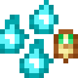

# Обработанный мезон

<figure><figcaption></figcaption></figure>

## Получение

#### _Крафт_

| ㅤ                                                                             |  Обработанный мезон                        |
| ----------------------------------------------------------------------------- | ------------------------------------------ |
| 
Огненный порошок + <a href="meson_1.md">Грубый мезон</a> + Сахар
 |  |

## Использование

#### _Как ингредиент при крафте_

