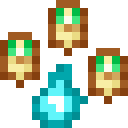

# Великолепный мезон

<figure><figcaption></figcaption></figure>

## Получение

#### _Крафт_

| ㅤ                                                                                |  Великолепный мезон                        |
| -------------------------------------------------------------------------------- | ------------------------------------------ |
| 
Огненный порошок + <a href="meson_3.md">Блестящий мезон</a> + Сахар
 |  |

## Использование

#### _Как ингредиент при крафте_

#### [Сияющий мезон](meson_5.md)

| ㅤ                                                                                   |  Сияющий мезон                             |
| ----------------------------------------------------------------------------------- | ------------------------------------------ |
| 
Огненный порошок + <a href="meson_4.md">Великолепный мезон</a> + Сахар
 |  |

