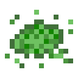

# Смесь мха

<figure><figcaption></figcaption></figure>

## Получение

#### Обжиг

| ㅤ        | Смесь мха                                              |
| -------- | ------------------------------------------------------ |
| Блок мха |  |

## Использование

#### _Как ингредиент при крафте_

#### [Осколок мха](moss\_shard.md)

| ㅤ                                                                                 | Осколок мха                                   |
| --------------------------------------------------------------------------------- | --------------------------------------------- |
| 
Огненный порошок + <a href="moss_blend.md">Смесь мха</a> + Ламинария
 |  |
