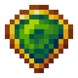

# Грубый кристалл мха

<figure><figcaption></figcaption></figure>

## Получение

#### _Крафт_

| ㅤ                                                                                   |  Грубый кристалл мха                           |
| ----------------------------------------------------------------------------------- | ---------------------------------------------- |
| 
Огненный порошок + <a href="moss_shard.md">Осколок мха</a> + Ламинария
 |  |

## Использование

#### _Как ингредиент при крафте_

#### [Обработанный кристалл мха](moss_gem_2.md)

| ㅤ                                                                                           |  Обработанный кристалл мха                     |
| ------------------------------------------------------------------------------------------- | ---------------------------------------------- |
| 
Огненный порошок + <a href="moss_gem_1.md">Грубый кристалл мха</a> + Ламинария
 |  |

