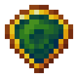

# Обработанный кристалл мха

<figure><figcaption></figcaption></figure>

## Получение

#### _Крафт_

| ㅤ                                                                                           |  Обработанный кристалл мха                     |
| ------------------------------------------------------------------------------------------- | ---------------------------------------------- |
| 
Огненный порошок + <a href="moss_gem_1.md">Грубый кристалл мха</a> + Ламинария
 |  |

## Использование

#### _Как ингредиент при крафте_

#### [Блестящий кристалл мха](moss_gem_3.md)

| ㅤ                                                                                                 |  Блестящий кристалл мха                        |
| ------------------------------------------------------------------------------------------------- | ---------------------------------------------- |
| 
Огненный порошок + <a href="moss_gem_2.md">Обработанный кристалл мха</a> + Ламинария
 |  |

