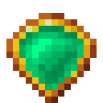

# Сияющий кристалл мха

<figure><figcaption></figcaption></figure>

## Получение

#### _Крафт_

| ㅤ                                                                                                 |  Сияющий кристалл мха                          |
| ------------------------------------------------------------------------------------------------- | ---------------------------------------------- |
| 
Огненный порошок + <a href="moss_gem_4.md">Великолепный кристалл мха</a> + Ламинария
 |  |

## Использование

#### _Как ингредиент при крафте_

#### [Мшистая жемчужина](moss_gem_6.md)

| ㅤ                                                                                            |  Мшистая жемчужина                             |
| -------------------------------------------------------------------------------------------- | ---------------------------------------------- |
| 
Огненный порошок + <a href="moss_gem_5.md">Сияющий кристалл мха</a> + Ламинария
 |  |

