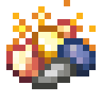

# Смесь нитроника

<figure><figcaption></figcaption></figure>

## Получение

#### _Крафт_
## Использование

#### _Как ингредиент при крафте_

#### [Осколок нитроника](nitronic_nugget.md)

| ㅤ                                                                            |  Осколок нитроника                                 |
| ---------------------------------------------------------------------------- | -------------------------------------------------- |
| 
<a href="nitronic_blend.md">Смесь нитроника</a> + Огненный порошок
 |  |

