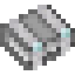

# Обычная руническая книга

<figure><figcaption></figcaption></figure>

## Получение

#### _Крафт_

| ㅤ                                                            |  Обычная руническая книга                      |
| ------------------------------------------------------------ | ---------------------------------------------- |
| 
Книга + <a href="coal_common.md">Обычный уголь</a>
 |  |

## Использование

#### _Как ингредиент при крафте_

#### [Редкая руническая книга](tome_rare.md)

| ㅤ                                                                                                         |  Редкая руническая книга                     |
| --------------------------------------------------------------------------------------------------------- | -------------------------------------------- |
| 
<a href="tome_common.md">Обычная руническая книга</a> + <a href="coal_rare.md">Редкий уголь</a>
 |  |

#### [Обычный кокон](chrysalis_common.md)

| ㅤ                                                                                                                                                                                                                                                                  |  Обычный кокон                                      |
| ------------------------------------------------------------------------------------------------------------------------------------------------------------------------------------------------------------------------------------------------------------------ | --------------------------------------------------- |
| 
<a href="hadron.md">Адрон</a> + <a href="bone_precision.md">Истинная кость</a> + <a href="moss_gem_6.md">Мшистая жемчужина</a> + <a href="tome_common.md">Обычная руническая книга</a> + <a href="cage_extra_large.md">Очень большая клетка</a>
 |  |

