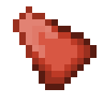

# Мощный камень огня

<figure><figcaption></figcaption></figure>

## Получение

#### _Крафт_

| ㅤ                                                                                                                                |  Мощный камень огня                                  |
| -------------------------------------------------------------------------------------------------------------------------------- | ---------------------------------------------------- |
| 
<a href="crude_fire_gem.md">Грубый камень огня</a> + <a href="fairy_ingot.md">Волшебный слиток</a> + Огненный заряд
 |  |

## Использование

#### _Как ингредиент при крафте_

#### [Отличный камень огня](fine_fire_gem.md)

| ㅤ                                                                                                                                      |  Отличный камень огня                          |
| -------------------------------------------------------------------------------------------------------------------------------------- | ---------------------------------------------- |
| 
<a href="powerful_fire_shard.md">Мощный камень огня</a> + <a href="fireite_ingot.md">Огненный слиток</a> + Огненный заряд
 |  |

