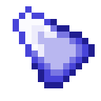

# Мощный камень воды

<figure><figcaption></figcaption></figure>

## Получение

#### _Крафт_

| ㅤ                                                                                                                                 |  Мощный камень воды                                   |
| --------------------------------------------------------------------------------------------------------------------------------- | ----------------------------------------------------- |
| 
<a href="crude_water_gem.md">Грубый камень воды</a> + <a href="fairy_ingot.md">Волшебный слиток</a> + Огненный заряд
 |  |

## Использование

#### _Как ингредиент при крафте_

#### [Отличный камень воды](fine_water_gem.md)

| ㅤ                                                                                                                                       |  Отличный камень воды                           |
| --------------------------------------------------------------------------------------------------------------------------------------- | ----------------------------------------------- |
| 
<a href="powerful_water_shard.md">Мощный камень воды</a> + <a href="fireite_ingot.md">Огненный слиток</a> + Огненный заряд
 |  |

