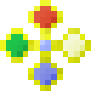

# Элементальный держатель

<figure><figcaption></figcaption></figure>

## Получение

#### _Крафт_

| ㅤ                                                                                                                                                                                                                                                                                                                                                                               |  Элементальный держатель                             |
| ------------------------------------------------------------------------------------------------------------------------------------------------------------------------------------------------------------------------------------------------------------------------------------------------------------------------------------------------------------------------------- | ---------------------------------------------------- |
| 
<a href="pristine_fire_gem.md">Чистый камень огня</a> + <a href="pristine_air_gem.md">Чистый камень воздуха</a> + <a href="pristine_water_gem.md">Чистый камень воды</a> + <a href="pristine_earth_gem.md">Чистый камень земли</a> + <a href="pure_element_holder_core.md">Пустой элементальный держатель</a> + <a href="fury_fire.md">Яростный огонь</a>
 |  |

## Использование

#### _Как ингредиент при крафте_

#### [Катализатор уничтожения](destruction_catalyst.md)

| ㅤ                                                                                                                                              |  Катализатор уничтожения                             |
| ---------------------------------------------------------------------------------------------------------------------------------------------- | ---------------------------------------------------- |
| 
<a href="dark.md">Тьма</a> + <a href="pure_element_holder.md">Элементальный держатель</a> + <a href="acid.md">Кислотная капля</a>
 |  |

