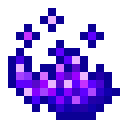

# Фиолетовое пламя

<figure><figcaption></figcaption></figure>

## Получение

#### _Крафт_

| ㅤ                                                                                                                       | Фиолетовое пламя                             |
| ----------------------------------------------------------------------------------------------------------------------- | -------------------------------------------- |
| 
<a href="fury_fire.md">Яростный огонь</a> + <a href="weak_arcana_potion.md">Зелье Арканы</a> + Осколок эха
 |  |

## Использование

#### _Как ингредиент при крафте_

#### [Мертвая зачарованная говядина](gobber2\_gooey\_beef.md)

| ㅤ                                                                                                                    | Мертвая зачарованная говядина                       |
| -------------------------------------------------------------------------------------------------------------------- | --------------------------------------------------- |
| 
<a href="ectoplasm.md">Эктоплазма</a> + Сырая говядина + <a href="purple_blaze.md">Фиолетовое пламя</a>
 |  |

#### [Мертвое зачарованное яблоко](gobber2\_gooey\_apple.md)

| ㅤ                                                                                                            | Мертвое зачарованное яблоко                          |
| ------------------------------------------------------------------------------------------------------------ | ---------------------------------------------------- |
| 
<a href="ectoplasm.md">Эктоплазма</a> + Яблоко + <a href="purple_blaze.md">Фиолетовое пламя</a>
 |  |

#### [Мертвый зачарованный хлеб](gobber2\_gooey\_bread.md)

| ㅤ                                                                                                          | Мертвый зачарованный хлеб                            |
| ---------------------------------------------------------------------------------------------------------- | ---------------------------------------------------- |
| 
<a href="ectoplasm.md">Эктоплазма</a> + Хлеб + <a href="purple_blaze.md">Фиолетовое пламя</a>
 |  |

#### [Темный кристалл слизня](pink\_slime\_crystal.md)

| ㅤ                                                                                                                         | Темный кристалл слизня                              |
| ------------------------------------------------------------------------------------------------------------------------- | --------------------------------------------------- |
| 
Сгусток слизи + <a href="purple_blaze.md">Фиолетовое пламя</a> + <a href="dark_crystal.md">Кристалл тьмы</a>
 |  |

#### [Активированный камень разумной брони](sentientarmourgem\_activated.md)

| ㅤ                                                                                                                               | Активированный камень разумной брони                        |
| ------------------------------------------------------------------------------------------------------------------------------- | ----------------------------------------------------------- |
| 
<a href="purple_blaze.md">Фиолетовое пламя</a> + <a href="sentientarmourgem_deactivated.md">Камень разумной брони</a>
 |  |

#### [Активированный камень коррозийной разумной брони](sentientarmourgem\_corrosive\_activated.md)

| ㅤ                                                                                                                                                     | Активированный камень коррозийной разумной брони                       |
| ----------------------------------------------------------------------------------------------------------------------------------------------------- | ---------------------------------------------------------------------- |
| 
<a href="purple_blaze.md">Фиолетовое пламя</a> + <a href="sentientarmourgem_corrosive_deactivated.md">Камень коррозийной разумной брони</a>
 |  |

#### [Активированный камень мстительной разумной брони](sentientarmourgem\_vengeful\_activated.md)

| ㅤ                                                                                                                                                    | Активированный камень мстительной разумной брони                      |
| ---------------------------------------------------------------------------------------------------------------------------------------------------- | --------------------------------------------------------------------- |
| 
<a href="purple_blaze.md">Фиолетовое пламя</a> + <a href="sentientarmourgem_vengeful_deactivated.md">Камень мстительной разумной брони</a>
 |  |

#### [Активированный камень разрушительной разумной брони](sentientarmourgem\_destructive\_activated.md)

| ㅤ                                                                                                                                                          | Активированный камень разрушительной разумной брони                      |
| ---------------------------------------------------------------------------------------------------------------------------------------------------------- | ------------------------------------------------------------------------ |
| 
<a href="purple_blaze.md">Фиолетовое пламя</a> + <a href="sentientarmourgem_destructive_deactivated.md">Камень разрушительной разумной брони</a>
 |  |

#### [Активированный камень стойкой разумной брони](sentientarmourgem\_steadfast\_activated.md)

| ㅤ                                                                                                                                                 | Активированный камень стойкой разумной брони                           |
| ------------------------------------------------------------------------------------------------------------------------------------------------- | ---------------------------------------------------------------------- |
| 
<a href="purple_blaze.md">Фиолетовое пламя</a> + <a href="sentientarmourgem_steadfast_deactivated.md">Камень стойкой разумной брони</a>
 |  |

#### [Душа монстра](basemonstersoul.md)

| ㅤ                                                                                                                                                                                                                                                           | Душа монстра                                   |
| ----------------------------------------------------------------------------------------------------------------------------------------------------------------------------------------------------------------------------------------------------------- | ---------------------------------------------- |
| 
<a href="purple_blaze.md">Фиолетовое пламя</a> + <a href="band_of_heiva_hunting.md">Сердце Хейву</a> + <a href="sentientarmourgem_activated.md">Активированный камень разумной брони</a> + <a href="weak_arcana_potion.md">Зелье Арканы</a>
 |  |

#### [Коррозийная душа монстра](basemonstersoul\_corrosive.md)

| ㅤ                                                                                                                                                                                                                                                          | Коррозийная душа монстра                                  |
| ---------------------------------------------------------------------------------------------------------------------------------------------------------------------------------------------------------------------------------------------------------- | --------------------------------------------------------- |
| 
<a href="purple_blaze.md">Фиолетовое пламя</a> + <a href="veilo.md">Вуаль</a> + <a href="sentientarmourgem_corrosive_activated.md">Активированный камень коррозийной разумной брони</a> + <a href="weak_arcana_potion.md">Зелье Арканы</a>
 |  |

#### [Разрушительная душа монстра](basemonstersoul\_destructive.md)

| ㅤ                                                                                                                                                                                                                                                                             | Разрушительная душа монстра                                 |
| ----------------------------------------------------------------------------------------------------------------------------------------------------------------------------------------------------------------------------------------------------------------------------- | ----------------------------------------------------------- |
| 
<a href="purple_blaze.md">Фиолетовое пламя</a> + <a href="runic_arc.md">Руническая дуга</a> + <a href="sentientarmourgem_destructive_activated.md">Активированный камень разрушительной разумной брони</a> + <a href="weak_arcana_potion.md">Зелье Арканы</a>
 |  |

#### [Стойкая душа монстра](basemonstersoul\_steadfast.md)

| ㅤ                                                                                                                                                                                                                                                               | Стойкая душа монстра                                      |
| --------------------------------------------------------------------------------------------------------------------------------------------------------------------------------------------------------------------------------------------------------------- | --------------------------------------------------------- |
| 
<a href="purple_blaze.md">Фиолетовое пламя</a> + <a href="astrolabe.md">Астролябия</a> + <a href="sentientarmourgem_steadfast_activated.md">Активированный камень стойкой разумной брони</a> + <a href="weak_arcana_potion.md">Зелье Арканы</a>
 |  |

#### [Мстительная душа монстра](basemonstersoul\_vengeful.md)

| ㅤ                                                                                                                                                                                                                                                            | Мстительная душа монстра                                 |
| ------------------------------------------------------------------------------------------------------------------------------------------------------------------------------------------------------------------------------------------------------------ | -------------------------------------------------------- |
| 
<a href="purple_blaze.md">Фиолетовое пламя</a> + <a href="hitchak.md">Хитчак</a> + <a href="sentientarmourgem_vengeful_activated.md">Активированный камень мстительной разумной брони</a> + <a href="weak_arcana_potion.md">Зелье Арканы</a>
 |  |

#### [Кристалл опыта 1 ур.](xp\_crystal\_0.md)

| ㅤ                                                                                                          | Кристалл опыта 1 ур.                          |
| ---------------------------------------------------------------------------------------------------------- | --------------------------------------------- |
| 
<a href="purple_blaze.md">Фиолетовое пламя</a> + <a href="arlemite_ingot.md">Слиток арлемита</a>
 |  |

#### [Кристалл опыта 2 ур.](xp\_crystal\_1.md)

| ㅤ                                                                                                                                                                        | Кристалл опыта 2 ур.                          |
| ------------------------------------------------------------------------------------------------------------------------------------------------------------------------ | --------------------------------------------- |
| 
<a href="purple_blaze.md">Фиолетовое пламя</a> + <a href="spawner_seeker.md">Пространственное ядро</a> + <a href="xp_crystal_0.md">Кристалл опыта 1 ур.</a>
 |  |

#### [Кристалл опыта 3 ур.](xp\_crystal\_2.md)

| ㅤ                                                                                                                                                                        | Кристалл опыта 3 ур.                          |
| ------------------------------------------------------------------------------------------------------------------------------------------------------------------------ | --------------------------------------------- |
| 
<a href="purple_blaze.md">Фиолетовое пламя</a> + <a href="spawner_seeker.md">Пространственное ядро</a> + <a href="xp_crystal_1.md">Кристалл опыта 2 ур.</a>
 |  |

#### [Кристалл опыта 4 ур.](xp\_crystal\_3.md)

| ㅤ                                                                                                                                                                        | Кристалл опыта 4 ур.                          |
| ------------------------------------------------------------------------------------------------------------------------------------------------------------------------ | --------------------------------------------- |
| 
<a href="purple_blaze.md">Фиолетовое пламя</a> + <a href="spawner_seeker.md">Пространственное ядро</a> + <a href="xp_crystal_2.md">Кристалл опыта 3 ур.</a>
 |  |

#### [Кристалл опыта 5 ур.](xp\_crystal\_4.md)

| ㅤ                                                                                                                                                                        | Кристалл опыта 5 ур.                          |
| ------------------------------------------------------------------------------------------------------------------------------------------------------------------------ | --------------------------------------------- |
| 
<a href="purple_blaze.md">Фиолетовое пламя</a> + <a href="spawner_seeker.md">Пространственное ядро</a> + <a href="xp_crystal_3.md">Кристалл опыта 4 ур.</a>
 |  |

#### [Драгоценная печать](perk\_seal.md)

| ㅤ                                                                                                                                                                                                                                  | Драгоценная печать                        |
| ---------------------------------------------------------------------------------------------------------------------------------------------------------------------------------------------------------------------------------- | ----------------------------------------- |
| 
<a href="totem_of_equinox.md">Тотем равноденствия</a> + <a href="spawner_seeker.md">Пространственное ядро</a> + <a href="purple_blaze.md">Фиолетовое пламя</a> + <a href="equinox_clock.md">Часы равноденствия</a>
 |  |

#### [Совершенная чешуя дракона](aquatic\_dragon\_scale.md)

| ㅤ                                                                                                                                                           | Совершенная чешуя дракона                             |
| ----------------------------------------------------------------------------------------------------------------------------------------------------------- | ----------------------------------------------------- |
| 
<a href="fireite_ingot.md">Огненный слиток</a> + <a href="dragon_scale.md">Драконья чешуя</a> + <a href="purple_blaze.md">Фиолетовое пламя</a>
 |  |

#### [Компонент чувств 2 ур.](cell\_component\_4k.md)

| ㅤ                                                                                                                                                                                                                                       | Компонент чувств 2 ур.                             |
| --------------------------------------------------------------------------------------------------------------------------------------------------------------------------------------------------------------------------------------- | -------------------------------------------------- |
| 
<a href="purple_blaze.md">Фиолетовое пламя</a> + <a href="cell_component_1k.md">Компонент чувств 1 ур.</a> + <a href="dislocator_advanced.md">Ячейка пространства</a> + <a href="enderite_ingot.md">Слиток эндерита</a>
 |  |

#### [Компонент чувств 3 ур.](cell\_component\_16k.md)

| ㅤ                                                                                                                                                                                                                                       | Компонент чувств 3 ур.                              |
| --------------------------------------------------------------------------------------------------------------------------------------------------------------------------------------------------------------------------------------- | --------------------------------------------------- |
| 
<a href="purple_blaze.md">Фиолетовое пламя</a> + <a href="cell_component_4k.md">Компонент чувств 2 ур.</a> + <a href="dislocator_advanced.md">Ячейка пространства</a> + <a href="enderite_ingot.md">Слиток эндерита</a>
 |  |

#### [Компонент чувств 4 ур.](cell\_component\_64k.md)

| ㅤ                                                                                                                                                                                                                                        | Компонент чувств 4 ур.                              |
| ---------------------------------------------------------------------------------------------------------------------------------------------------------------------------------------------------------------------------------------- | --------------------------------------------------- |
| 
<a href="purple_blaze.md">Фиолетовое пламя</a> + <a href="cell_component_16k.md">Компонент чувств 3 ур.</a> + <a href="dislocator_advanced.md">Ячейка пространства</a> + <a href="enderite_ingot.md">Слиток эндерита</a>
 |  |

#### [Компонент чувств 5 ур.](cell\_component\_256k.md)

| ㅤ                                                                                                                                                                                                                                        | Компонент чувств 5 ур.                               |
| ---------------------------------------------------------------------------------------------------------------------------------------------------------------------------------------------------------------------------------------- | ---------------------------------------------------- |
| 
<a href="purple_blaze.md">Фиолетовое пламя</a> + <a href="cell_component_64k.md">Компонент чувств 4 ур.</a> + <a href="dislocator_advanced.md">Ячейка пространства</a> + <a href="enderite_ingot.md">Слиток эндерита</a>
 |  |

#### [Данные настроек](settings\_data.md)

| ㅤ                                                                                                                                                                           | Данные настроек                               |
| --------------------------------------------------------------------------------------------------------------------------------------------------------------------------- | --------------------------------------------- |
| 
<a href="purple_blaze.md">Фиолетовое пламя</a> + <a href="cell_component_256k.md">Компонент чувств 5 ур.</a> + <a href="enderite_ingot.md">Слиток эндерита</a>
 |  |

#### [Модуль памяти 2 ур.](16384k\_fluid.md)

| ㅤ                                                                                                                                                                                                                                    | Модуль памяти 2 ур.                          |
| ------------------------------------------------------------------------------------------------------------------------------------------------------------------------------------------------------------------------------------ | -------------------------------------------- |
| 
<a href="purple_blaze.md">Фиолетовое пламя</a> + <a href="materialy-yaica/256k.md">Модуль памяти 1 ур.</a> + <a href="spawner_seeker.md">Пространственное ядро</a> + <a href="enderite_ingot.md">Слиток эндерита</a>
 |  |

#### [Модуль памяти 3 ур.](65536k\_fluid.md)

| ㅤ                                                                                                                                                                                                                            | Модуль памяти 3 ур.                          |
| ---------------------------------------------------------------------------------------------------------------------------------------------------------------------------------------------------------------------------- | -------------------------------------------- |
| 
<a href="purple_blaze.md">Фиолетовое пламя</a> + <a href="16384k_fluid.md">Модуль памяти 2 ур.</a> + <a href="spawner_seeker.md">Пространственное ядро</a> + <a href="enderite_ingot.md">Слиток эндерита</a>
 |  |

#### [Модуль памяти 4 ур.](262144k\_fluid.md)

| ㅤ                                                                                                                                                                                                                            | Модуль памяти 4 ур.                           |
| ---------------------------------------------------------------------------------------------------------------------------------------------------------------------------------------------------------------------------- | --------------------------------------------- |
| 
<a href="purple_blaze.md">Фиолетовое пламя</a> + <a href="65536k_fluid.md">Модуль памяти 3 ур.</a> + <a href="spawner_seeker.md">Пространственное ядро</a> + <a href="enderite_ingot.md">Слиток эндерита</a>
 |  |

#### [Модуль памяти 5 ур.](1048576k\_fluid.md)

| ㅤ                                                                                                                                                                                                                            | Модуль памяти 5 ур.                            |
| ---------------------------------------------------------------------------------------------------------------------------------------------------------------------------------------------------------------------------- | ---------------------------------------------- |
| 
<a href="purple_blaze.md">Фиолетовое пламя</a> + <a href="262144k_fluid.md">Модуль памяти 4 ур.</a> + <a href="spawner_seeker.md">Пространтвенное ядро</a> + <a href="enderite_ingot.md">Слиток эндерита</a>
 |  |

#### [Данные формы](shape\_data.md)

| ㅤ                                                                                                                                                                   | Данные формы                               |
| ------------------------------------------------------------------------------------------------------------------------------------------------------------------- | ------------------------------------------ |
| 
<a href="purple_blaze.md">Фиолетовое пламя</a> + <a href="1048576k_fluid.md">Модуль памяти 5 ур.</a> + <a href="enderite_ingot.md">Слиток эндерита</a>
 |  |

#### [Звезда Эндера](ender\_star.md)

| ㅤ                                                                                                                                                | Звезда Эндера                              |
| ------------------------------------------------------------------------------------------------------------------------------------------------ | ------------------------------------------ |
| 
<a href="enderite_ingot.md">Слиток эндерита</a> + <a href="catalyst.md">Квазар</a> + <a href="purple_blaze.md">Фиолетовое пламя</a>
 |  |
