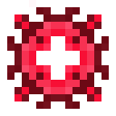

# Диск Квадротика

<figure><figcaption></figcaption></figure>

## Получение

#### _Крафт_

| ㅤ                                                                                                                |  Диск Квадротика                               |
| ---------------------------------------------------------------------------------------------------------------- | ---------------------------------------------- |
| 
<a href="pardimal_disk.md">Диск Пардимала</a> + Изумруд + <a href="fury_fire.md">Яростный огонь</a>
 |  |

## Использование

#### _Как ингредиент при крафте_

#### [Диск Гелиоса](heliosis_disk.md)

| ㅤ                                                                                                                  |  Диск Гелиоса                                 |
| ------------------------------------------------------------------------------------------------------------------ | --------------------------------------------- |
| 
<a href="quadrotic_disk.md">Диск Квадротика</a> + Изумруд + <a href="fury_fire.md">Яростный огонь</a>
 |  |

