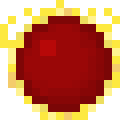
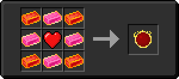

# Сердце Хана

<figure><figcaption></figcaption></figure>

## Получение

#### _Крафт_

| ㅤ                                                                                                                                                     |  Сердце Хана                       |
| ----------------------------------------------------------------------------------------------------------------------------------------------------- | ---------------------------------- |
| 
<a href="fairy_ingot.md">Волшебный слиток</a> + <a href="heart.md">Наполненное сердце</a> + <a href="red_aurum_ingot.md">Слиток Хана</a>
 |  |

## Использование

#### _Как ингредиент при крафте_

#### [Сердце дракона](dragon_heart.md)

| ㅤ                                                                                                                                                                 |  Сердце дракона                              |
| ----------------------------------------------------------------------------------------------------------------------------------------------------------------- | -------------------------------------------- |
| 
<a href="klein_star_6.md">Звезда Клейна 6 ур.</a> + <a href="red.md">Сердце Хана</a> + <a href="destruction_catalyst.md">Катализатор уничтожения</a>
 |  |

