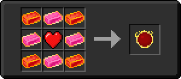

# Слиток Хана

<figure><figcaption></figcaption></figure>

## Получение

#### _Крафт_

|                                                                                                                                                                                                                                                                                                                     | Слиток Хана                                      |
| ------------------------------------------------------------------------------------------------------------------------------------------------------------------------------------------------------------------------------------------------------------------------------------------------------------------- | ------------------------------------------------ |
| 
<a href="healing_stone.md">Исцеляющий камень</a> + <a href="ice_stone.md">Ледяной камень</a> + <a href="bluefire_stone.md">Камень синего огня</a> + <a href="bloodgem.md">Кровавый камень</a> + <a href="spawner_seeker.md">Пространственное ядро</a> + <a href="acid.md">Кислотная капля</a>
 |  |

## Использование

#### _Как ингредиент при крафте_

#### [Сердце Хана](red.md)

|                                                                                                                                                       | Сердце Хана                        |
| ----------------------------------------------------------------------------------------------------------------------------------------------------- | ---------------------------------- |
| 
<a href="fairy_ingot.md">Волшебный слиток</a> + <a href="heart.md">Наполненное сердце</a> + <a href="red_aurum_ingot.md">Слиток Хана</a>
 |  |

#### [Грубый камень воздуха](crude\_air\_gem.md)

|                                                                                             | Грубый камень воздуха                          |
| ------------------------------------------------------------------------------------------- | ---------------------------------------------- |
| 
Золотой слиток + <a href="red_aurum_ingot.md">Слиток Хана</a> + Огненный заряд
 |  |

#### [Грубый камень земли](crude\_earth\_gem.md)

|                                                                                      | Грубый камень земли                              |
| ------------------------------------------------------------------------------------ | ------------------------------------------------ |
| 
Изумруд + <a href="red_aurum_ingot.md">Слиток Хана</a> + Огненный заряд
 |  |

#### [Грубый камень огня](crude\_fire\_gem.md)

|                                                                                                | Грубый камень огня                              |
| ---------------------------------------------------------------------------------------------- | ----------------------------------------------- |
| 
Редстоуновая пыль + <a href="red_aurum_ingot.md">Слиток Хана</a> + Огненный заряд
 |  |

#### [Грубый камень воды](crude\_water\_gem.md)

|                                                                                      | Грубый камень воды                               |
| ------------------------------------------------------------------------------------ | ------------------------------------------------ |
| 
Лазурит + <a href="red_aurum_ingot.md">Слиток Хана</a> + Огненный заряд
 |  |
