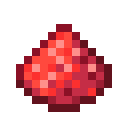

# Пыль красного алмаза

<figure><figcaption></figcaption></figure>

## Получение

#### _Крафт_

|                               |  Пыль красного алмаза                              |
| ----------------------------- | -------------------------------------------------- |
| 
Редстоуновая пыльАлмаз
 |  |

## Использование

#### _Как ингредиент при крафте_

#### [Кусок красного алмаза](red_diamond_chunk.md)

|                                                                                                                                                                     |  Кусок красного алмаза                             |
| ------------------------------------------------------------------------------------------------------------------------------------------------------------------- | -------------------------------------------------- |
| 
<a href="red_glowcane_dust.md">Пыль красного алмаза</a> + <a href="weak_arcana_potion.md">Зелье Арканы</a> + <a href="fury_fire.md">Яростный огонь</a>
 |  |

