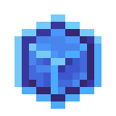

# Очищенный кристалл маны

<figure><figcaption></figcaption></figure>

## Получение

#### _Крафт_

| ㅤ                                                                                                                                                    |  Очищенный кристалл маны                                |
| ---------------------------------------------------------------------------------------------------------------------------------------------------- | ------------------------------------------------------- |
| 
<a href="perk_gem_sky.md">Драгоценный камень неба</a> + <a href="aquamarine.md">Аквамарин</a> + <a href="mana_pearl.md">Жемчуг маны</a>
 |  |

## Использование

#### _Как ингредиент при крафте_

#### [Слиток кристаллической матрицы](crystal_matrix_ingot.md)

| ㅤ                                                                                                                                                                                |  Слиток кристаллической матрицы                       |
| -------------------------------------------------------------------------------------------------------------------------------------------------------------------------------- | ----------------------------------------------------- |
| 
<a href="refained_mana_crystal2.md">Очищенный кристалл маны</a> + <a href="flame_green.md">Пылающий сгусток</a> + <a href="diamond_lattice.md">Алмазная решетка</a>
 |  |

#### [Пылающий сгусток](flame_green.md)

| ㅤ                                                                                                                     |  Пылающий сгусток                           |
| --------------------------------------------------------------------------------------------------------------------- | ------------------------------------------- |
| 
<a href="fury_fire.md">Яростный огонь</a> + <a href="refained_mana_crystal2.md">Очищенный кристалл маны</a>
 |  |

