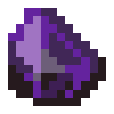

# Саронитовый страз

<figure><figcaption></figcaption></figure>

## Получение

#### _Мобы_

_Может выпасть с_ [Осквернённого Громилы](../sushestva/moby/oskvernyonnyi-gromila.md) в количестве одной штуки.

## Использование

#### _Как ингредиент при крафте_

__[_Чумной янтарь_](chumnoi-yantar.md)__

| ㅤ                                                                                                                                                         | Чумной янтарь                                                 |
| --------------------------------------------------------------------------------------------------------------------------------------------------------- | ------------------------------------------------------------- |
| 
<a href="obogashennyi-shlak.md">Обогащенный шлак</a> + Саронитовый страз +  <a href="pokrytyi-slizyu-zhemchug.md">Покрытый слизью жемчуг</a>
 |  |

