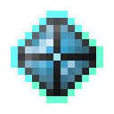

# Активированный камень разумной брони

<figure><figcaption></figcaption></figure>

## Получение

#### _Крафт_

|                                                                                                                                 |  Активированный камень разумной брони                       |
| ------------------------------------------------------------------------------------------------------------------------------- | ----------------------------------------------------------- |
| 
<a href="purple_blaze.md">Фиолетовое пламя</a> + <a href="sentientarmourgem_deactivated.md">Камень разумной брони</a>
 |  |

## Использование

#### _Как ингредиент при крафте_

#### [Душа монстра](basemonstersoul.md)

|                                                                                                                                                                                                                                                             |  Душа монстра                                  |
| ----------------------------------------------------------------------------------------------------------------------------------------------------------------------------------------------------------------------------------------------------------- | ---------------------------------------------- |
| 
<a href="purple_blaze.md">Фиолетовое пламя</a> + <a href="band_of_heiva_hunting.md">Сердце Хейву</a> + <a href="sentientarmourgem_activated.md">Активированный камень разумной брони</a> + <a href="weak_arcana_potion.md">Зелье Арканы</a>
 |  |

