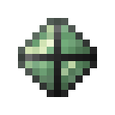

# Камень коррозийной разумной брони

<figure><figcaption></figcaption></figure>

## Получение

#### _Крафт_

| ㅤ                                                                                                                    |  Камень коррозийной разумной брони                                       |
| -------------------------------------------------------------------------------------------------------------------- | ------------------------------------------------------------------------ |
| 
<a href="logic_processor.md">Логический процессор</a> + Изумруд + <a href="soulstone.md">Камень душ</a>
 |  |

## Использование

#### _Как ингредиент при крафте_

#### [Активированный камень коррозийной разумной брони](sentientarmourgem_corrosive_activated.md)

| ㅤ                                                                                                                                                     |  Активированный камень коррозийной разумной брони                      |
| ----------------------------------------------------------------------------------------------------------------------------------------------------- | ---------------------------------------------------------------------- |
| 
<a href="purple_blaze.md">Фиолетовое пламя</a> + <a href="sentientarmourgem_corrosive_deactivated.md">Камень коррозийной разумной брони</a>
 |  |

