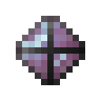

# Камень стойкой разумной брони

<figure><figcaption></figcaption></figure>

## Получение

#### _Крафт_

|                                                                                                                               |  Камень стойкой разумной брони                                           |
| ----------------------------------------------------------------------------------------------------------------------------- | ------------------------------------------------------------------------ |
| 
<a href="logic_processor.md">Логический процессор</a> + Осколок аметиста + <a href="soulstone.md">Камень душ</a>
 |  |

## Использование

#### _Как ингредиент при крафте_

#### [Активированный камень стойкой разумной брони](sentientarmourgem_steadfast_activated.md)

|                                                                                                                                                   |  Активированный камень стойкой разумной брони                          |
| ------------------------------------------------------------------------------------------------------------------------------------------------- | ---------------------------------------------------------------------- |
| 
<a href="purple_blaze.md">Фиолетовое пламя</a> + <a href="sentientarmourgem_steadfast_deactivated.md">Камень стойкой разумной брони</a>
 |  |

