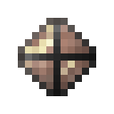

# Камень мстительной разумной брони

<figure><figcaption></figcaption></figure>

## Получение

#### _Крафт_

| ㅤ                                                                                                                              |  Камень мстительной разумной брони                                      |
| ------------------------------------------------------------------------------------------------------------------------------ | ----------------------------------------------------------------------- |
| 
<a href="logic_processor.md">Логический процессор</a> + Редстоуновая пыль + <a href="soulstone.md">Камень душ</a>
 |  |

## Использование

#### _Как ингредиент при крафте_

#### [Активированный камень мстительной разумной брони](sentientarmourgem_vengeful_activated.md)

| ㅤ                                                                                                                                                    |  Активированный камень мстительной разумной брони                     |
| ---------------------------------------------------------------------------------------------------------------------------------------------------- | --------------------------------------------------------------------- |
| 
<a href="purple_blaze.md">Фиолетовое пламя</a> + <a href="sentientarmourgem_vengeful_deactivated.md">Камень мстительной разумной брони</a>
 |  |

