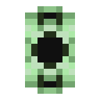

# Данные настроек

<figure><figcaption></figcaption></figure>

## Получение

#### _Крафт_

| ㅤ                                                                                                                                                                           |  Данные настроек                              |
| --------------------------------------------------------------------------------------------------------------------------------------------------------------------------- | --------------------------------------------- |
| 
<a href="purple_blaze.md">Фиолетовое пламя</a> + <a href="cell_component_256k.md">Компонент чувств 5 ур.</a> + <a href="enderite_ingot.md">Слиток эндерита</a>
 |  |

## Использование

#### _Как ингредиент при крафте_

#### [Творческий конденсатор](creative_capacitor.md)

| ㅤ                                                                                                                                                                                                                                                                      |  Творческий конденсатор                            |
| ---------------------------------------------------------------------------------------------------------------------------------------------------------------------------------------------------------------------------------------------------------------------- | -------------------------------------------------- |
| 
<a href="enderite_ingot.md">Слиток эндерита</a> + <a href="settings_data.md">Данные настроек</a> + <a href="shape_data.md">Данные формы</a> + <a href="ender_disc.md">Диск Эндера</a> + <a href="legendary_ender_eye.md">Легендарное око эндера</a>
 |  |

