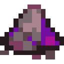

# Сгусток шлака

<figure><figcaption></figcaption></figure>

## Получение

#### _Мобы_

_Может выпасть с_ [Осквернённого Громилы](../sushestva/moby/oskvernyonnyi-gromila.md) в количестве одной штуки.

## Использование

#### _Как ингредиент при крафте_

#### [Обогащенный шлак](sgustok-shlaka.md#obogashennyi-shlak)

| ㅤ                                                                                                                               | Обогащенный шлак                                               |
| ------------------------------------------------------------------------------------------------------------------------------- | -------------------------------------------------------------- |
| 
<a href="red_glowcane_dust.md">Пыль красного алмаза</a> + Сгусток шлака + <a href="high.md">Пыль синего алмаза</a>
 |  |

[Гадкие ягоды](gadkie-yagody.md)

| ㅤ                                                                                                                                                    | Гадкие ягоды                                                      |
| ---------------------------------------------------------------------------------------------------------------------------------------------------- | ----------------------------------------------------------------- |
| 
<a href="obogashennyi-shlak.md">Обогащенный шлак</a> + <a href="sgustok-shlaka.md">Сгусток шлака</a> + Сладкие ягоды + Чумной янтарь
 |  |
