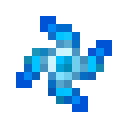

# Снежинка

<figure><figcaption></figcaption></figure>

## Получение

#### _Крафт_

|                                                                                 | Снежинка                                           |
| ------------------------------------------------------------------------------- | -------------------------------------------------- |
| 
Блок снега + Снежок + <a href="star_flare.md">Звездная вспышка</a>
 |  |

## Использование

#### _Как ингредиент при крафте_

#### [Стержень метели](blizz\_rod.md)

|                                                                                                                                   | Стержень метели                           |
| --------------------------------------------------------------------------------------------------------------------------------- | ----------------------------------------- |
| 
Слеза гаста + <a href="snowflake_shuriken.md">Снежинка</a> + <a href="overcharged_alloy.md">Перезаряженный сплав</a>
 |  |
