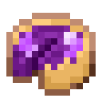

# Исходный пирог

<figure><figcaption></figcaption></figure>

## Получение

#### _Крафт_

|                                                             | Исходный пирог                                    |
| ----------------------------------------------------------- | ------------------------------------------------- |
| 
Сахар + Бутылочка мёда + Плод хоруса + Яйцо
 |  |

## Использование

#### _Как ингредиент при крафте_

#### [Пирог мечты](dream\_pie.md)

|                                                                                                                                                                                                                                                                                                                                                                                                                                                                                       | Пирог мечты                               |
| ------------------------------------------------------------------------------------------------------------------------------------------------------------------------------------------------------------------------------------------------------------------------------------------------------------------------------------------------------------------------------------------------------------------------------------------------------------------------------------- | ----------------------------------------- |
| 
<a href="shepherds_pie_block.md">Пирог пастуха</a> + <a href="chocolate_pie.md">Шоколадный пирог</a> + <a href="blaze_cake.md">Пылающий пирог</a> + <a href="cherry_pie.md">Вишневый пирог</a> + <a href="weak_arcana_potion.md">Зелье Арканы</a> + <a href="crimson_berry_pie.md">Малиновый пирог</a> + <a href="source_berry_pie.md">Исходный пирог</a> + <a href="apple_pie.md">Яблочный пирог</a> + <a href="blueberry_pie.md">Черничный пирог</a>
 |  |
