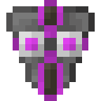

# Компонент пространственной ячейки 2 ур.

<figure><figcaption></figcaption></figure>

## Получение

#### _Крафт_

|                                                                                                                                                                                                                                                       |  Компонент пространственной ячейки 2 ур.                    |
| ----------------------------------------------------------------------------------------------------------------------------------------------------------------------------------------------------------------------------------------------------- | ----------------------------------------------------------- |
| 
<a href="fireite_ingot.md">Огненный слиток</a> + <a href="acid.md">Кислотная капля</a> + <a href="dislocator_advanced.md">Ячейка пространства</a> + <a href="spatial_cell_component_2.md">Компонент пространственной ячейки 1 ур.</a>
 |  |

## Использование

#### _Как ингредиент при крафте_

#### [Компонент пространственной ячейки 3 ур.](spatial_cell_component_128.md)

|                                                                                                                                                                                                                                                        |  Компонент пространственной ячейки 3 ур.                     |
| ------------------------------------------------------------------------------------------------------------------------------------------------------------------------------------------------------------------------------------------------------ | ------------------------------------------------------------ |
| 
<a href="spatial_cell_component_16.md">Компонент пространственной ячейки 2 ур.</a> + <a href="acid.md">Кислотная капля</a> + <a href="dislocator_advanced.md">Ячейка пространства</a> + <a href="fireite_ingot.md">Огненный слиток</a>
 |  |

