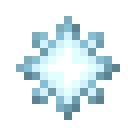

# Звездная вспышка

<figure><figcaption></figcaption></figure>

## Получение

#### _Крафт_

| ㅤ                                                                            |  Звездная вспышка                          |
| ---------------------------------------------------------------------------- | ------------------------------------------ |
| 
Осколок эха + Огненный заряд + <a href="catalyst.md">Квазар</a>
 |  |

## Использование

#### _Как ингредиент при крафте_

#### [Зелье Арканы](weak_arcana_potion.md)

| ㅤ                                                                                                                                                                                     |  Зелье Арканы                                       |
| ------------------------------------------------------------------------------------------------------------------------------------------------------------------------------------- | --------------------------------------------------- |
| 
Пузырёк опыта + <a href="blizz_rod.md">Стержень метели</a> + <a href="star_flare.md">Звездная вспышка</a> + Бутылочка воды + <a href="aquamarine.md">Аквамарин</a>
 |  |

#### [Снежинка](snowflake_shuriken.md)

| ㅤ                                                                               |  Снежинка                                          |
| ------------------------------------------------------------------------------- | -------------------------------------------------- |
| 
Блок снега + Снежок + <a href="star_flare.md">Звездная вспышка</a>
 |  |

