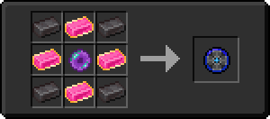

# Компонент скрытности

<figure><figcaption></figcaption></figure>

## Получение

#### _Крафт_

| ㅤ                                                                                                                                       |  Компонент скрытности                        |
| --------------------------------------------------------------------------------------------------------------------------------------- | -------------------------------------------- |
| 
<a href="fairy_ingot.md">Волшебный слиток</a> + <a href="spawner_seeker.md">Пространственное ядро</a> + Незеритовый слиток
 |  |

## Использование

#### _Как ингредиент при крафте_

#### [Звезда Клейна 1 ур.](klein_star_1.md)

| ㅤ                                                                                                    |  Звезда Клейна 1 ур.                          |
| ---------------------------------------------------------------------------------------------------- | --------------------------------------------- |
| 
<a href="life_arc.md">Перо жизни</a> + <a href="stealthpotion.md">Компонент скрытности</a>
 |  |

