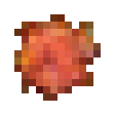

# Камень солнца

<figure><figcaption></figcaption></figure>

## Получение

#### _Крафт_

|                           |  Камень солнца                          |
| ------------------------- | --------------------------------------- |
| 
Звезда НезераМагма
 |  |

## Использование

#### _Как ингредиент при крафте_

#### [Драгоценный камень дня](perk_gem_day.md)

|                                                                                                               |  Драгоценный камень дня                       |
| ------------------------------------------------------------------------------------------------------------- | --------------------------------------------- |
| 
Осколок эха<a href="sunstone.md">Камень солнца</a> + <a href="fireite_ingot.md">Огненный слиток</a>
 |  |

