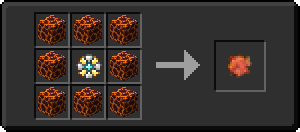

# Камень солнца

<figure><figcaption></figcaption></figure>

## Получение

#### _Крафт_

|                                 | Камень солнца                           |
| ------------------------------- | --------------------------------------- |
| 
Звезда Незера + Магма
 |  |

## Использование

#### _Как ингредиент при крафте_

#### [Драгоценный камень дня](perk\_gem\_day.md)

|                                                                                                                     | Драгоценный камень дня                        |
| ------------------------------------------------------------------------------------------------------------------- | --------------------------------------------- |
| 
Осколок эха + <a href="sunstone.md">Камень солнца</a> + <a href="fireite_ingot.md">Огненный слиток</a>
 |  |
