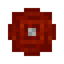

# Термическая плита

<figure><figcaption></figcaption></figure>

## Получение

#### _Крафт_

| ㅤ                                                                                                                           |  Термическая плита                                   |
| --------------------------------------------------------------------------------------------------------------------------- | ---------------------------------------------------- |
| 
<a href="energy_crystal.md">Энергетический кристалл</a> + <a href="collector.md">Коллектор</a> + Медный слиток
 |  |

## Использование

#### _Как ингредиент при крафте_

#### [Логический процессор](logic_processor.md)

| ㅤ                                                                                               |  Логический процессор                           |
| ----------------------------------------------------------------------------------------------- | ----------------------------------------------- |
| 
<a href="thermoelectric_plate.md">Термическая плита</a> + Кремень + Золотой слиток
 |  |

