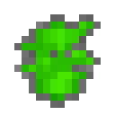

# Плотный сырой уранит

<figure><figcaption></figcaption></figure>

## Получение

#### _Крафт_

| ㅤ                                                               |  Плотный сырой уранит                                |
| --------------------------------------------------------------- | ---------------------------------------------------- |
| 
<a href="uraninite_raw.md">Сырой уранит</a> + Изумруд
 |  |

## Использование

#### _Как ингредиент при крафте_

#### [Кристалл уранита](uraninite_crystal.md)

| ㅤ                                                                                                                           |  Кристалл уранита                                 |
| --------------------------------------------------------------------------------------------------------------------------- | ------------------------------------------------- |
| 
<a href="uraninite_raw_dense.md">Плотный сырой уранит</a> + <a href="spawner_seeker.md">Пространственное ядро</a>
 |  |

