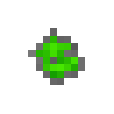

# Несовершенный сырой уранит

<figure><figcaption></figcaption></figure>

## Получение

#### _Крафт_

| ㅤ                                 |  Несовершенный сырой уранит                         |
| --------------------------------- | --------------------------------------------------- |
| 
Пузырёк опыта + Изумруд
 |  |

## Использование

#### _Как ингредиент при крафте_

#### [Сырой уранит](uraninite_raw.md)

| ㅤ                                                                                  |  Сырой уранит                                 |
| ---------------------------------------------------------------------------------- | --------------------------------------------- |
| 
<a href="uraninite_raw_poor.md">Несовершенный сырой уранит</a> + Изумруд
 |  |

