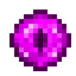

# Око Взора

<figure><figcaption></figcaption></figure>

## Получение

#### _Крафт_

| ㅤ                                                                                                                       |  Око Взора                                   |
| ----------------------------------------------------------------------------------------------------------------------- | -------------------------------------------- |
| 
<a href="spawner_seeker.md">Пространственное ядро</a> + <a href="acid.md">Кислотная капля</a> + Око Эндера
 |  |

## Использование

#### _Как ингредиент при крафте_

#### [Конденсатор виверн](wyvern_capacitor.md)

| ㅤ                                                                                                                                                                                                                                                                                                       |  Конденсатор виверн                              |
| ------------------------------------------------------------------------------------------------------------------------------------------------------------------------------------------------------------------------------------------------------------------------------------------------------- | ------------------------------------------------ |
| 
<a href="acid.md">Кислотная капля</a> + <a href="watching_eye.md">Око Взора</a> + <a href="spatial_cell_component_128.md">Компонент пространственной ячейки 3 ур.</a> + <a href="obsidian_skull_shield.md">Обсидиановый череп</a> + <a href="corrupted_pixie.md">Испорченная фея</a>
 |  |

