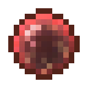

# Слабая сфера крови

<figure><figcaption></figcaption></figure>

## Получение

#### _Крафт_

|                                                                                   | Слабая сфера крови                          |
| --------------------------------------------------------------------------------- | ------------------------------------------- |
| 
Свёкла + <a href="divining_rod_3.md">Великолепная волшебная палочка</a>
 |  |

## Использование

#### _Как ингредиент при крафте_

#### [Сфера крови ученика](apprenticebloodorb.md)

|                                                                                                                             | Сфера крови ученика                               |
| --------------------------------------------------------------------------------------------------------------------------- | ------------------------------------------------- |
| 
<a href="weakbloodorb.md">Слабая сфера крови</a> + <a href="divining_rod_3.md">Великолепная волшебная палочка</a>
 |  |
