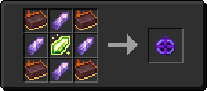

# Кристалл опыта 5 ур.

<figure><figcaption></figcaption></figure>

## Получение

#### _Крафт_

|                                                                                                                                                                          | Кристалл опыта 5 ур.                          |
| ------------------------------------------------------------------------------------------------------------------------------------------------------------------------ | --------------------------------------------- |
| 
<a href="purple_blaze.md">Фиолетовое пламя</a> + <a href="spawner_seeker.md">Пространственное ядро</a> + <a href="xp_crystal_3.md">Кристалл опыта 4 ур.</a>
 |  |

## Использование

#### _Как ингредиент при крафте_

#### [Вуаль](veilo.md)

|                                                                                                                            | Вуаль                                |
| -------------------------------------------------------------------------------------------------------------------------- | ------------------------------------ |
| 
Изумруд + <a href="fireite_ingot.md">Огненный слиток</a> + <a href="xp_crystal_4.md">Кристалл опыта 5 ур.</a>
 |  |

#### [Руническая дуга](runic\_arc.md)

|                                                                                                                                   | Руническая дуга                           |
| --------------------------------------------------------------------------------------------------------------------------------- | ----------------------------------------- |
| 
Золотой слиток + <a href="fireite_ingot.md">Огненный слиток</a> + <a href="xp_crystal_4.md">Кристалл опыта 5 ур.</a>
 |  |

#### [Хитчак](hitchak.md)

|                                                                                                                                      | Хитчак                                 |
| ------------------------------------------------------------------------------------------------------------------------------------ | -------------------------------------- |
| 
Редстоуновая пыль + <a href="fireite_ingot.md">Огненный слиток</a> + <a href="xp_crystal_4.md">Кристалл опыта 5 ур.</a>
 |  |

#### [Астролябия](astrolabe.md)

|                                                                                                                                     | Астролябия                               |
| ----------------------------------------------------------------------------------------------------------------------------------- | ---------------------------------------- |
| 
Осколок аметиста + <a href="fireite_ingot.md">Огненный слиток</a> + <a href="xp_crystal_4.md">Кристалл опыта 5 ур.</a>
 |  |

#### [Сердце Хейву](band\_of\_heiva\_hunting.md)

|                                                                                                                          | Сердце Хейву                                            |
| ------------------------------------------------------------------------------------------------------------------------ | ------------------------------------------------------- |
| 
Алмаз + <a href="fireite_ingot.md">Огненный слиток</a> + <a href="xp_crystal_4.md">Кристалл опыта 5 ур.</a>
 |  |
