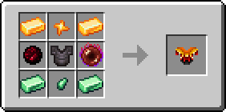

# 👕 Кираса Пламени

<figure><figcaption></figcaption></figure>

## Характеристики

\+8 Броня

\+3 Твёрдость брони

\+1 Сопротивление отбрасыванию

## Способности

Кираса Пламени при надевании разблокирует [_**Навык 2**_** – Пылающий прыжок**](kosa-plameni/#sposobnosti) **для предмета** [**Пылающая Коса**](kosa-plameni/)**.** \
**Также необходим для разблокировки** [_**Ультимейт-навыка**_** – Коса адского пламени**](kosa-plameni/#sposobnosti) **** для предмета [Пылающая Коса](kosa-plameni/).


_**Совет**_**:** начните с получения [Пылающей Косы](kosa-plameni/), после чего приобретайте другие сетовые предметы для разблокировки новых способностей


## Получение

#### _Крафт_

|                                                                                                                                                                                                                                                                                                                                                                                                                                                                                                                               | Кираса Пламени                                                                          |
| ----------------------------------------------------------------------------------------------------------------------------------------------------------------------------------------------------------------------------------------------------------------------------------------------------------------------------------------------------------------------------------------------------------------------------------------------------------------------------------------------------------------------------- | --------------------------------------------------------------------------------------- |
| 
<a href="../../materialy/metally-i-mineraly/citrinovyi-slitok.md">Цитриновый слиток</a> + <a href="../../materialy/metally-i-mineraly/kusochek-citrina.md">Кусочек цитрина</a> + <a href="broken-reference">Кусок Амфирмиса</a> + Незеритовый нагрудник + <a href="broken-reference">Кровавая жемчужина</a> + <a href="../../materialy/metally-i-mineraly/turmalinovyi-slitok.md">Турмалиновый слиток</a> + <a href="../../materialy/metally-i-mineraly/kusochek-turmalina.md">Кусочек турмалина</a>
 |  |
